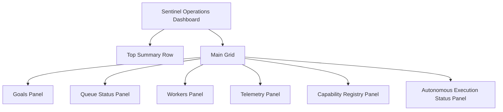

# Sentinel Operations Dashboard Proposal

## Purpose

The Sentinel Operations Dashboard is a Streamlit control surface for observing the current Sentinel runtime and orchestration state. It should present the minimum operational picture needed to understand what Sentinel is doing, what it can do, and what is blocked, without changing autonomous execution behavior.

## Current Architecture Summary

Sentinel already exposes the key runtime surfaces needed for a dashboard:

- Autonomous execution is driven by `AutonomousDeveloper` and `Orchestrator`.
- Queue and workflow state live in the task JSON files managed by `TaskQueue` and `WorkflowStateManager`.
- Worker availability is exposed through `WorkerSelector` and heartbeat state.
- Telemetry is persisted by `ExecutionTelemetry`.
- Capability metadata now has a standalone JSON-backed registry in `backend/database/capability_registry.py`.

The dashboard should read from these existing sources only. It should not duplicate orchestration logic or embed task execution rules.

## Dashboard Goals

The dashboard should answer these operational questions quickly:

1. What goals are currently discovered?
2. Is the autonomous queue idle, pending, or running?
3. Which workers are available and alive?
4. What telemetry has been recorded most recently?
5. Which capabilities exist in the registry and what is their status?
6. Is autonomous execution currently progressing or stalled?

## Proposed Data Sources

| Dashboard Area | Source | Notes |
| --- | --- | --- |
| Goals | `GET /goals` | Derived from autonomous goal discovery |
| Queue Status | `GET /autonomous/status` | Shows queue state and next task |
| Workers | `GET /workers` | Shows available workers from the selector |
| Telemetry | `GET /telemetry` | Shows recent execution entries |
| Capability Registry | `CapabilityRegistry` | Reads registry entries from JSON |
| Autonomous Execution Status | `GET /autonomous/status` + telemetry | Derived status summary from queue and execution records |

## Proposed Page Architecture

The page should be organized as a single operational dashboard with a top summary row and four primary sections beneath it.

### Top Summary Row

- Goals discovered count
- Queue status badge
- Active workers count
- Recent telemetry status
- Capability registry active count
- Autonomous execution status badge

### Primary Sections

1. Goals panel
2. Queue status panel
3. Workers panel
4. Telemetry panel
5. Capability registry panel
6. Autonomous execution status panel

## Component Layout

### Suggested Screen Layout

### Detailed Component Map

#### 1. Goals Panel

- Source: `/goals`
- Contents:
  - discovered goals list
  - total count
  - empty-state message when no goals exist

#### 2. Queue Status Panel

- Source: `/autonomous/status`
- Contents:
  - queue status badge
  - next task preview
  - queue summary counts where available

#### 3. Workers Panel

- Source: `/workers`
- Contents:
  - list of available workers
  - worker count
  - optional alive/idle grouping if heartbeat data becomes available through a later endpoint

#### 4. Telemetry Panel

- Source: `/telemetry`
- Contents:
  - recent execution entries
  - status history
  - goal, worker, and task type summary per entry

#### 5. Capability Registry Panel

- Source: `CapabilityRegistry`
- Contents:
  - module name
  - capability type
  - route
  - worker type
  - status

#### 6. Autonomous Execution Status Panel

- Source: `/autonomous/status` and `/telemetry`
- Contents:
  - derived state such as idle, pending, running, or error
  - last observed execution status
  - last telemetry update timestamp if present

## Data Refresh Model

- Dashboard data should be read-only.
- Auto-refresh should be bounded and predictable.
- Each panel should refresh independently from its own source so a slow telemetry file does not block goals or worker visibility.
- The dashboard should surface stale-data indicators when a source cannot be loaded.

## Suggested UI Behavior

- Use compact status badges for queue and execution state.
- Use tables for capability registry and telemetry.
- Use list cards for goals and workers.
- Provide empty states instead of silent blanks.
- Keep the layout operational and dense, not decorative.

## Non-Goals

- No autonomous execution logic changes.
- No task mutation controls in the first version.
- No AI-generated summaries.
- No duplicate store for goals, workers, telemetry, or capabilities.

## Recommended Build Order

1. Add a read-only dashboard shell in Streamlit.
2. Connect each panel to the existing Sentinel data sources.
3. Add refresh and empty-state handling.
4. Add filters for capability status and telemetry status.
